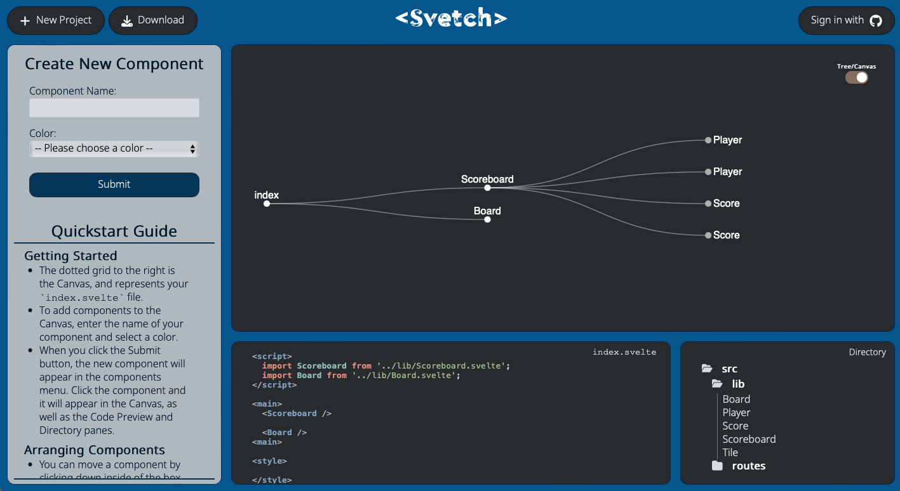

## Get ready to Svetch! A front end prototyping tool used to create SvelteKit project frameworks.

# How do I use Svetch?
## - Head to the [Svetch.io](https://www.svetch.io/) homepage
@@ -18,24 +18,25 @@

## - Create any components that you want
The dotted grid to the right is the canvas, and represents your Index.svelte file.  To add components to the canvas, enter the name of your component and select a color.

When you hit the Submit button, the new component will appear in the components menu. Click the component and it will appear in the canvas, as well as in file structure window.

## - Arranging any Components in the way that you want
You can move a component by clicking down inside of the box and dragging it around the canvas, then release your mouse to finalize it's position.

You can also resize your components by clicking down and dragging the small black tab at the bottom right corner.To remove a component from the canvas click on the "X" in the upper right corner.

## - Tracking Heirarchy
Svetch will automatically track the heirarchy you create in the canvas and update your component files accordingly.

You can view a tree diagram of your component hierarchy by clicking the toggle button in the upper right corner of the canvas.  Once there, you can click on the name of your components to expand the tree and see the components nested inside.

## Code Block previews component code, including the index!

To preview a components code, simply click on its box inside of the canvas, and the code block will update (remember that the entire canvas defaults to Index.svelte).  

## Export your project!

To download your project, simply hit download and provide a project name. You will recieve a downloaded zip file of your project from the browser. Or sign in with github and save to a new repo!

<video src="./static/video.mp4" width= 50% height= 50% alt="export"/>

# Want to Contribute?
The incredibly active, supportive community is one of the best parts of building in Svelte. Do you have a chart component you'd like to share? Notice anything missing, not working, or not available yet that you'd like to see? Submit a pull request to the contributor branch!

## Contributors 
- Daniel Palumbo | [Linkedin](https://www.linkedin.com/in/daniel-palumbo-735715137/) | [GitHub](https://github.com/DRPalumbo17)
- E Kathuria | [Linkedin](https://linkedin.com/in/ekathuria) | [GitHub](https://github.com/bozoputer)
- Kevin Wright | [Linkedin](http://www.linkedin.com/in/kwrightt/) | [GitHub](https://github.com/ktw33)
- Mathew Lapeer | [Linkedin](https://www.linkedin.com/in/matthew-lapeer) | [GitHub](https://github.com/matthewlapeer)
