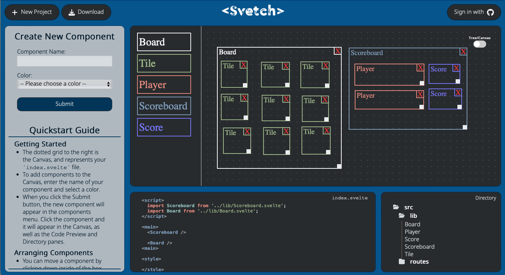

# Svetch
A frontend prototyping tool used to create SvelteKit projects. Get ready to Svetch! 

## How to access the app
Launch the app from [Svetch.io](https://www.svetch.io/) homepage, directly access it [here](https://app.svetch.io)

## To use
### Create Components
The dotted grid to the right is the canvas, and represents your `index.svelte` file.  To add components to the canvas, enter the name of your component and select a color.

When you click the Submit button, the new component will appear in the components library (left of Canvas). Click the component and it will appear in the Canvas, as well as the Code Preview and Directory panes.

### Arrange Components
You can move a component by clicking down inside of the box and dragging it around the Canvas, then release your mouse to finalize its position.

You can also resize your components by clicking down and dragging the small tab at the bottom right corner. To remove a component from the canvas click on the X in the upper right corner.

### Track Hierarchy
Svetch will automatically track the hierarchy you create in the Canvas and update your component files accordingly.

You can view a tree diagram of your component hierarchy by clicking the toggle button in the upper right corner of the Canvas.  Once there, you can click on the name of your components to expand the tree and see the components nested structure.

### Code Preview
To preview a component’s code, simply click on its box inside of the Canvas or its name in the Directory pane, and the Code Preview pane will update (Note that the entire canvas defaults to `index.svelte`).  

### Download or Export
To download your project, simply click download and provide a project name. You will receive a downloaded zip file of your project from the browser. Or sign in with GitHub and save your work to a new repo!

## Want to Contribute?
The incredibly active, supportive community is one of the best parts of building in Svelte. Do you have a feature you'd like to share? Notice anything missing, not working, or not available yet that you'd like to see? Submit a pull request!

## Contributors 
- Daniel Palumbo | [Linkedin](https://www.linkedin.com/in/daniel-palumbo-735715137/) | [GitHub](https://github.com/DRPalumbo17)
- E Kathuria | [Linkedin](https://linkedin.com/in/ekathuria) | [GitHub](https://github.com/bozoputer)
- Kevin Wright | [Linkedin](http://www.linkedin.com/in/kwrightt/) | [GitHub](https://github.com/ktw33)
- Matthew Lapeer | [Linkedin](https://www.linkedin.com/in/matthew-lapeer) | [GitHub](https://github.com/matthewlapeer)
